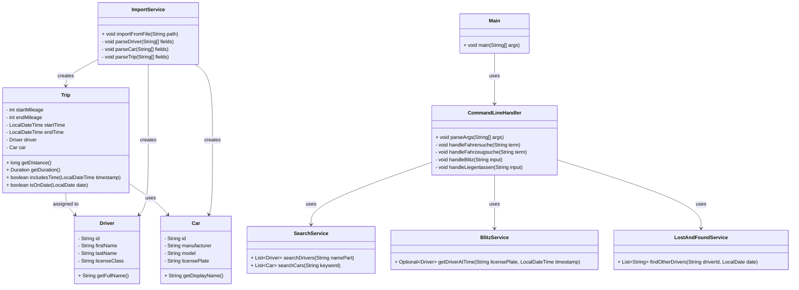

# dienstwagen-datenbank-java
Java-Anwendung zur Verwaltung von Dienstwagen, Fahrern und Fahrten – inklusive Kommandozeilen-Interface, Dateibasierendem Datenimport, und Unit-Tests. Projektarbeit im Rahmen des Sommersemesters 2025 an der DHBW Stuttgart (TINF24).

## 🧩 UML-Diagramm

