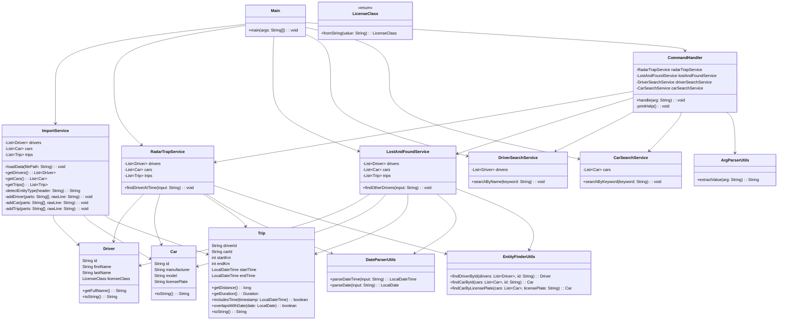

# Dienstwagendatenbank – Java Projekt DHBW 2025

**Projektname:** Dienstwagendatenbank Java  
**Autor:** Simon Riedinger  
**Kurs:** DHBW Stuttgart – Informatik  
**Modul:** Programmieren 2 (Java)  
**Abgabejahr:** 2025

---

## 🧭 Überblick

Dieses Konsolenprogramm verwaltet eine einfache Datenbank aus Fahrern, Fahrzeugen und deren Fahrten.  
Ziel ist es, Informationen zu verwalten und gezielt abzufragen – z. B. welcher Fahrer ein Auto zu einem bestimmten Zeitpunkt fuhr oder wer nach einem bestimmten Fahrer ein Fahrzeug genutzt hat.

Das Projekt wurde vollständig in Java (Version 24.0.1) ohne externe Libraries entwickelt und manuell kompiliert.

---

## ⚙️ Funktionsweise

Beim Start der Anwendung wird eine strukturierte Datei (`dienstwagenprojekt2025.db`) eingelesen, welche Fahrer, Fahrzeuge und Fahrten beschreibt.

Das Programm bietet verschiedene Kommandozeilenoptionen zur Analyse der Daten:

```bash
java Main --fahrersuche=<Suchbegriff>
java Main --fahrzeugsuche=<Suchbegriff>
java Main --fahrerZeitpunkt=S-XX-1234;2024-01-01T14:00:00
java Main --fahrerDatum=F001;2024-01-01
```

### Unterstützte Befehle

| Option                     | Beschreibung |
|---------------------------|--------------|
| `--fahrersuche=<Text>`    | Sucht Fahrer anhand von Namensteilen |
| `--fahrzeugsuche=<Text>`  | Sucht Fahrzeuge anhand von Marke/Modell/Kennzeichen |
| `--fahrerZeitpunkt=…`     | Gibt Fahrer aus, die ein Fahrzeug zum angegebenen Zeitpunkt gefahren haben |
| `--fahrerDatum=…`         | Listet alle anderen Fahrer, die am gleichen Tag dasselbe Fahrzeug wie ein bestimmter Fahrer genutzt haben |
| `--help`                  | Zeigt Hilfeübersicht an |

---

## 📂 Datei: dienstwagenprojekt2025.db

Die Import-Datei ist eine textbasierte `.db`-Datei mit folgendem Format:

```txt
New_Entity: fahrerId, vorname, nachname, klasse
F001, Anna, Muster, B

New_Entity: fahrzeugId, hersteller, modell, kennzeichen
C001, BMW, 320i, S-XX-1234

New_Entity: fahrerId, fahrzeugId, startKM, endKM, startzeit, endzeit
F001, C001, 10000, 10100, 2024-01-01T08:00:00, 2024-01-01T09:00:00
```

Ungültige Zeilen oder doppelte IDs werden ignoriert.

---

## 🧪 JUnit 5 Tests

Die wichtigsten Funktionen wurden mit Unit-Tests abgesichert:

- **ImportServiceTest**  
  Prüft Datenimport, Fehlerbehandlung bei Duplikaten, Datumsformaten und Referenzen.

- **DriverSearchServiceTest**  
  Testet ob Fahrersuche über die Kommandozeile funktioniert.

- **CarSearchServiceTest**  
  Testet ob Fahrzeugsuche korrekt filtert.

- **LostAndFoundServiceTest**  
  Findet andere Fahrer desselben Fahrzeugs am selben Tag. Testet positive Fälle, kein Match und falsches Format.

- **RadarTrapServiceTest**  
  Testet Fahrerermittlung anhand von Kennzeichen und Uhrzeit. Behandelt auch Zeit außerhalb der Fahrt sowie fehlerhafte Eingaben.

---

## 🧱 Aufbau (Klassendiagramm)



---

## ✅ Voraussetzungen

- Java 24.0.1
- Kommandozeile (z. B. `Terminal`, `CMD` oder `PowerShell`)
- Datei: `dienstwagenprojekt2025.db` im `src/` Verzeichnis

---

## 🧠 Hinweise

- Fehlerhafte Eingaben (z. B. unbekannte IDs, falsches Datum) werden robust behandelt.
- Die Anwendung ignoriert fehlerhafte Zeilen im Datenimport, gibt aber Hinweise in der Konsole aus.
- Es wird keine externe Bibliothek verwendet – nur Standard-Java (SE).

---

© 2025 Simon Riedinger – DHBW Stuttgart